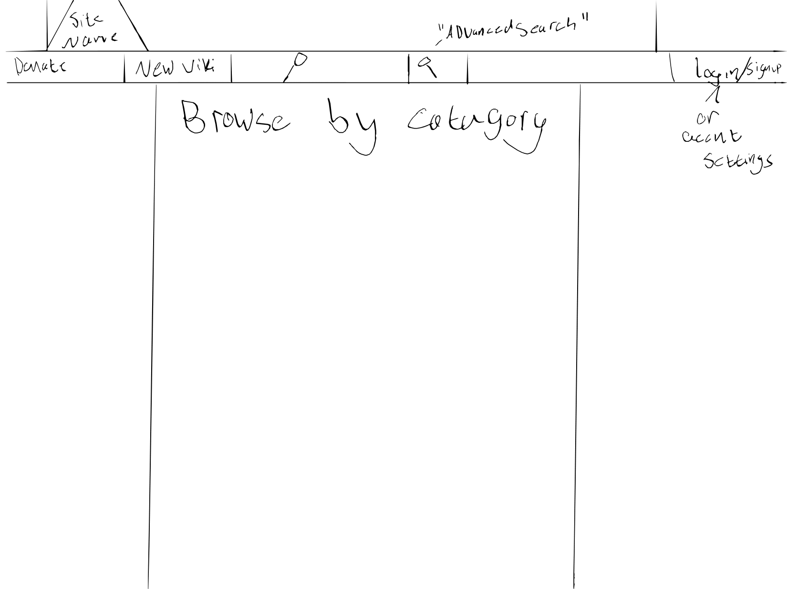
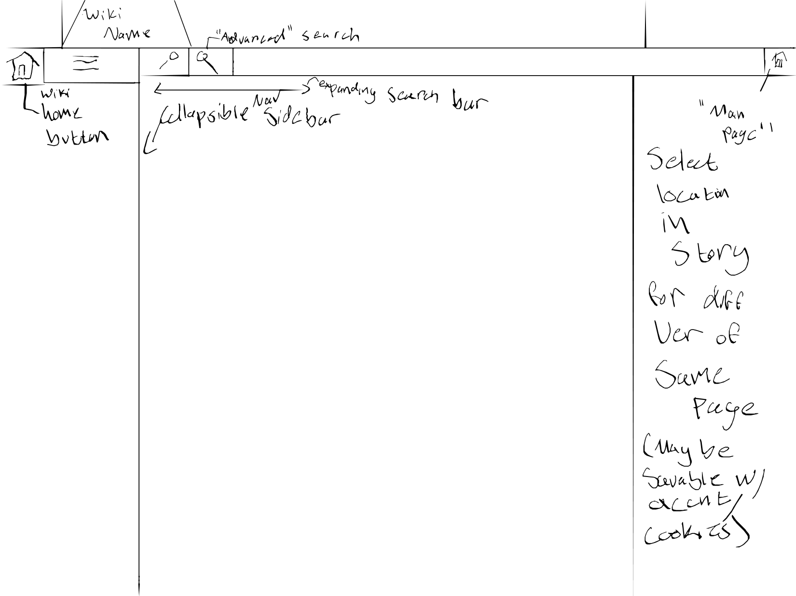
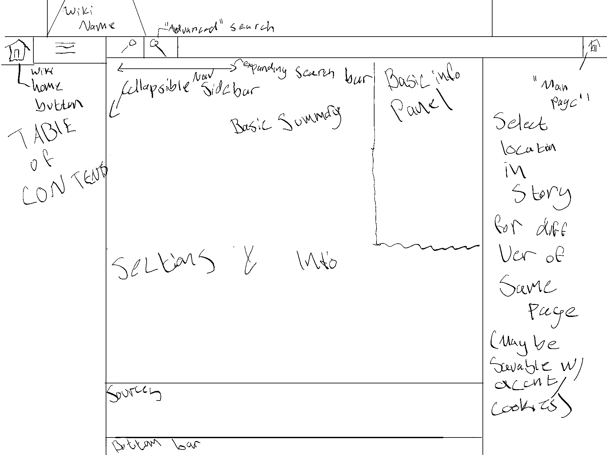

# The Idea
I am horrible at coming up with ideas usually. When I was trying to come up with something for this project I basically just sat staring at my screen for 20 minutes. Then I realized something. I bashed Fandom in my assignment 0, and something I always say <del>usually hypocritically</del> is, don't criticize people unless you can do it better. So I'm going to try to design a wiki farm. 
## Contents
[planned layout for assignment 1](#week-1-plan)  
[planned layout for assignment 2](#week-2-plan)  
[Week 3 and 4 stuff](#weeks-3--4)  
[Changes to make ready for final project](#final)
# Week 1 plan
Like with Fandom there will be a main homepage where users can find wikis that they're searching for.

The two sidebars will be filled with <a href="https://youtu.be/KpPE85Jogjw?si=zzoPQacab8fY9wdY&t=16">ads</a>, but I feel that this layout will feel cleaner that Fandom's.

The main changes that I anyways wanted to make were to how Fandom displays individual wikis. Rather than primarily promoting the main wiki farm or other wikis, if I were to design one I would focus the sidebars and search functionality to just the wiki that the user is on, with a home button in the top right if they want to browse a different wiki.  
The right sidebar could even have a selector for the graduations of spoilers that a user would want access to (again the bottom half of said sidebar would need to be filled with ads to make the wiki farm profitable, the left sidebar would also have ads whenever the menu is collapsed).
# Week 2 plan
Adding onto what I did with week 1, I'm going to design how articles would look like on the site, with some inspiration from wikipedia and other similar sites.

Similar to other wikis, there will be a box to the side that has basic information about the article contents, with the main summary at the top along with a table of contents.
# Weeks 3 & 4
Finally going to add a top-nav, I didn't initally realize, but during week 2, I added a handful of features that were supposed to be for these weeks
# Weeks 5 & 6
Made the slider for spoilers on article pages
# Final
Adding in a form to suggest new articles or request new wikis as well as a default page for new wikis and articles